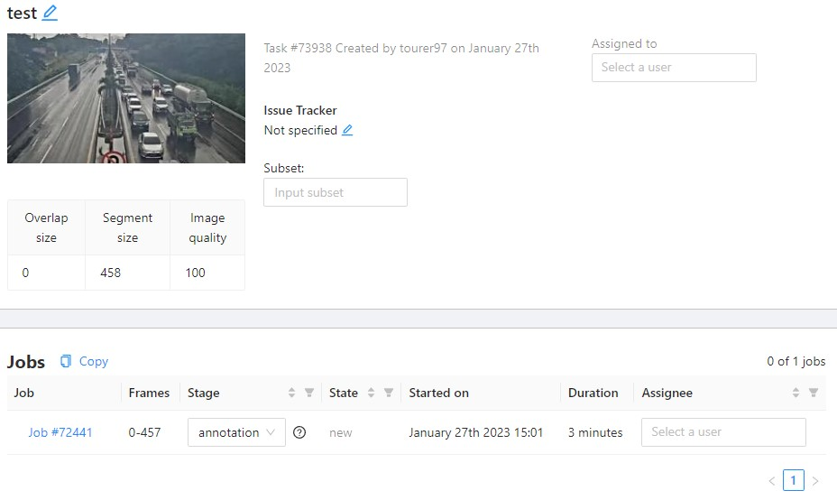

# CVAT
CVAT는 컴퓨터 비전을 위한 대화형 비디오 및 이미지 주석 도구이다.   
https://github.com/opencv/cvat 에서 이용 가능하다.  
CVAT은 크롬에서만 사용이 가능하다.

# 프로젝트 생성

1. 상단 목록에 Projects 선택
2. 상단 오른쪽에 ' __+__ ' 버튼을 클릭하여 새로운 프로젝트 생성

3. __Name__ 을 통해 프로젝트 이름 작성
4. Labels: 항목에 __Add label__ 을 통하여 라벨 입력(enter로 빠르게 가능)
5. __submit & continue__ 를 통하여 제출
  

# 이미지 업로드

1. 하단에 '+' 버튼을 클릭 후 __Create a new task__ 클릭  

2. task Name 입력 후, __Select files__ 를 통하여 이미지 파일들을 업로드
3. __Advanced configuration__ 에서 Image quality를 100%로 변경
4. __submit & continue__ 를 통하여 제출

# bbox 그리기

1. 다시 프로젝트로 돌아가서 방금 업로드한 task를 open

2. __job__ 하단에 있는 고유번호를 클릭하여 작업창으로 이동

3. 작업
    * shape를 클릭하여 원하는 detection을 만든다.  
    (shape를 미리 다 그려놓고 옆에 라벨에서 ctrl + 번호를  통하여 손 쉽게 라벨을 변경할 수 있다.)
    * detection을 전부 하였다면 menu에서 __export job dataset__ 을 통하여 원하는 방식으로 aug를 추출할 수 있다.

# 왜 CVAT을 사용할까?
Yolo와 같이 모델을 학습하기 위해서는 미리 bbox에 대한 정답지가 있어야 한다. 따라서 CVAT를 사용하여 bbox augmentation을 정의하여 준다.
