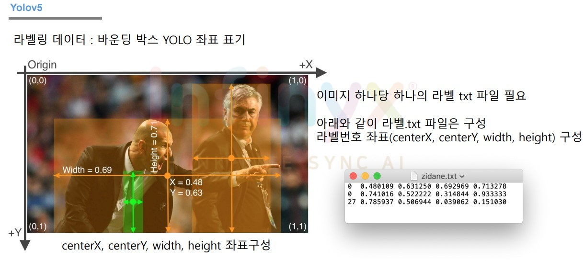
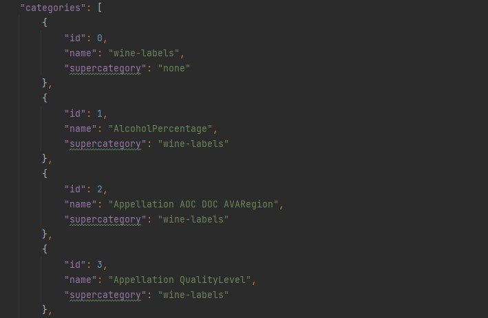
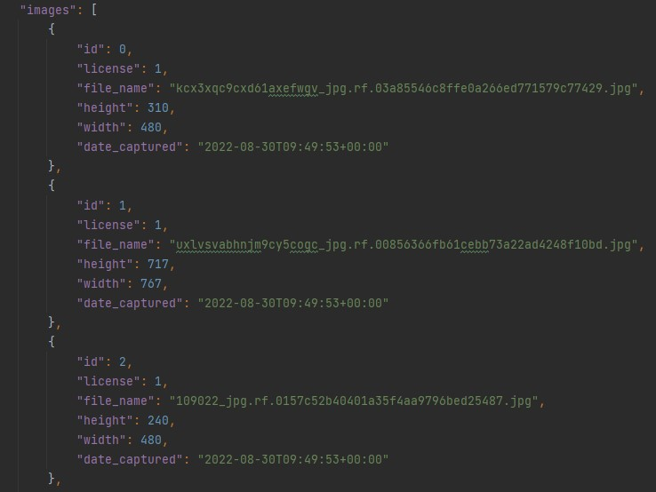
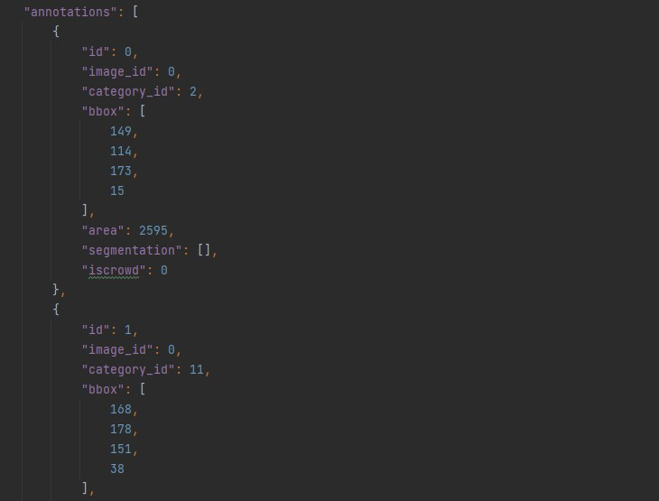

# json 파일을 Yolov5로 변환

학습하기 전 CVAT에서 직접 그린 라벨들을 coco 파일(json)로 추출한 다음 Yolov5로 변환하는 작업을 해야한다.  
 
Yolov5 형식은 아래와 같다.

그리고 이미지 명과 라벨 명은 동일해야 한다.  
ex) example.jpg = example.txt

실습링크:
[https://github.com/MindException/Yolov5_Project/blob/main/WIne_detection/coco_to_Yolov5.py](https://github.com/MindException/Yolov5_Project/blob/main/WIne_detection/coco_to_Yolov5.py)

# 처리 과정

코딩하기 전 처리과정을 한 번 요약하여 본다.

1. 폴더 안에 있는 json 파일 찾기
2. json 파일 읽기 & 라벨 찾기
3. 라벨 & bbox 찾기
4. bbox data -> Yolov5 data 변환 및 저장
5. 이미지 파일 이동

## 1. 폴더 안에 있는 json 파일 찾기

aug에 대한 정보가 있는 json 파일을 먼저 찾아야한다.

```py

def find_json_file(json_folder_path):
    all_root = []

    for (path, dir, files) in os.walk(json_folder_path):
        for filename in files:
            ext = os.path.splitext(filename)[-1]    #을 통하여 파일 확장자명 리스트를 찾는다.
            # ext -> json을 찾는다.
            if ext == ".json":
                root = os.path.join(path, filename)
                # json 파일의 경로가 생성되어진다.
                all_root.append(root)

    return all_root

```

여기서 중요하게 볼 함수는 __os.walk()__ 이다.  
os.walk는 폴더 안에 있는 구성요소를 탐색하며 다니는 함수이다.  
반복 횟수는 존재하는 폴더의 개수(path)와 동일하다.  
* __path__ 는 root폴더, train, test, valid로 총 4번 반복하며 한 번 반복 할 때마다 폴더의 경로를 반환한다.  
* __dir__ 는 존재하는 폴더명을 반환한다. tree와 같이 계층적으로 반환하며, 반환할게 없는 경우 []를 반환한다.  
* __files__ 는 각 path에 존재하는 file명을 반환한다.

## 2. json 파일 읽기 & 라벨 찾기

json 파일은 dict로 반환하는 성질이 있으며, 좀 더 쉽게 설명하자면 key 값을 통해 안 쪽으로 타고 들어가는 느낌으로 사용하면 편하게 사용이 가능하다.

```py
import json

#json 파일 열기
with open(json_path, "r") as file:
    json_data = json.load(file)
```

다른 언어를 사용하다 보면 파일의 경우 열었으면 무조건 파일을 닫아줘야 파일에 손상이 안 간다고 배웠을 것이다.  
파이썬은 with를 사용하면 자동으로 파일을 안전하게 닫아주어서 매우 편리하게 설계되어 있다.


json 파일은 위 사진과 같이 되어있다.  
따라서 dict에서 categories라는 key값을 찾아서 반환하여 사용하면 된다. 코드는 아래와 같다.

```py
 #json 파일 라벨 읽기
labels = {}     #라벨 딕션어리 만들기
    
for category in json_data["categories"]:
    labels[category["id"]] = category["name"]
```

## 3. 라벨 & bbox 찾기

먼저 json 파일의 구조를 보겠다.  
### image

### annotation


여기서 생각해 볼 사항은 annotation에 들어 있는 이미지명이 파일명이 아니라 id라는 점이다.  
따라서 id가 key 값이고 이미지명이 value인 dict를 만들어서 이 문제를 해결한다.

```py
images_info_list = json_data["images"]

id_dict = {} # 번호 : 파일 이름
for image_info in images_info_list:
     if image_info["file_name"] in file_list:
        id_dict[image_info["id"]] = image_info["file_name"]         #번호와 딕션어리 추가
```

이제 다음으로 해결해야 될 문제는 bbox와 라벨을 저장하는 것이다.  
 annotation 부분을 보면 같은 "image_id"가 여러 개의 bbox를 가지고 있는 것을 알 수 있다.  
그리고 bbox에서 label을 표시하여야 되기 때문에 이것을 만족시키려면
* Key는 __id__ 이며,
* Value는 [라벨번호1, [bbox 정보 리스트1], 라벨번호2, [bbox 정보 리스트2], ..... ]의 형태가 되어야 한다.

위의 조건을 코드로 변환하면 아래와 같다.

```py
# 이제 bbox list가 들어있는 딕션어리 만들기
bbox_dict = {}
for id_num in list(id_dict.keys()):
    bbox_dict[id_num] = []      #bbox들을 담을 리스트를 생성


# bbox 추가하기
for dict in json_data["annotations"]:
    bbox_dict[dict["image_id"]].append(dict["category_id"])     # 라벨 추가
    bbox_dict[dict["image_id"]].append(dict["bbox"])            # bbox 추가

```

## 4. bbox data -> Yolov5 data 변환 및 저장

먼저 설명하기 전 코드를 보겠다.

```py
for meta_data_key, meta_data_bbox in bbox_dict.items():

    file_name = id_dict[meta_data_key].split(".")[:-1]
    file_name = ".".join(file_name)

    with open(f"{dataset_labels_path}/{file_name}.txt", 'a') as f:
        # 홀수는 라벨 번호, 짝수는 bbox 정보가 들어잇다.
        for i, meta_data in enumerate(meta_data_bbox):
            if (i+1) % 2 == 1:
                # 홀수일 경우 라벨 추가
                f.write(f"{meta_data} ")

            else:
                # 짝수일 경우 bbox 추가

                # yolo 형식으로 파일 변환 0~1 사이로 정규화 시켜야 한다.
                img_shape_path = "./wine_labels_coco" + "/" + json_path.split("\\")[1] + "/" + f"{file_name}.jpg"
                img = cv2.imread(img_shape_path)

                h, w, c = img.shape

                # center는 최대 최소 더하고 나누기 2가 제일 정확
                # json 파일과 비교 결과 최소값x, 최소값y, 변화량x, 변화량y
                center_x = ((meta_data[0] + (meta_data[0] + meta_data[2])) / 2) / w
                center_y = ((meta_data[1] + (meta_data[1] + meta_data[3])) / 2) / h
                object_width = meta_data[2] / w
                object_height = meta_data[3] / h

                f.write(f"{center_x} {center_y} {object_width} {object_height} \n")
```

큰 틀을 먼저 설명하자면 Yolov5 라벨 파일명은 이미지 파일명과 같아야 하며,  
txt파일 형식은 "__라벨번호__ __중앙값x__ __중앙값y__ __너비__ __높이__" 로 이루어져 있다.

json파일에는 시작점x, 시작점y, 너비, 높이가 들어있는데 이것을 비율로 저장하는 것이 중요하다.  
슈도 코드로 형식을 설명하자면 아래와 같다
```
중앙x값 구하기

( 시작점 x값 + (시작점 x값 + 너비) ) / 2 => 처음 시작과 끝을 더한 후 절반으로 나누어 중앙을 구한다.

비율중앙x값 구하기

중앙 x값 / 이미지 너비 => 중앙 x값의 위치를 전체 이미지 x로 나누어 0~1 사이의 비율로 나타낸다.
```

## 5. 이미지 파일 이동

라벨이 위치한 root폴더에 이미지도 같이 이동시켜서 새로운 root 폴더를 만든다.  
파일을 이동시킬 경우에는 __shutil.move__ 를 사용한다.

```py
# 파일 이동
shutil.move(origin_img_path, move_img_path)
```

path에는 파일명.속성 끝까지 전부 들어간다.